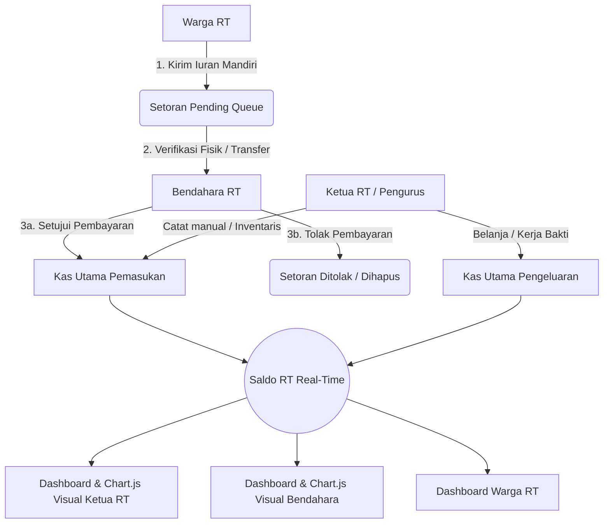

# 🏠 SIKAS - Sistem Informasi Kas RT

<p align="center">
  <a href="#" target="_blank">
    <!-- SIKAS Vector Art representation -->
    <svg width="150" height="150" viewBox="0 0 32 32" fill="none" xmlns="http://www.w3.org/2000/svg" style="background: linear-gradient(135deg, #1e3a8a 0%, #3b82f6 100%); border-radius: 2rem; padding: 1.5rem; box-shadow: 0 20px 25px -5px rgba(59, 130, 246, 0.3);">
        <path d="M16 3L4 13.5V27.5C4 28.3284 4.67157 29 5.5 29H26.5C27.3284 29 28 28.3284 28 27.5V13.5L16 3Z" fill="white" fill-opacity="0.15" stroke="white" stroke-width="2" stroke-linejoin="round"/>
        <path d="M12 29V19C12 18.4477 12.4477 18 13 18H19C19.5523 18 20 18.4477 20 19V29" stroke="white" stroke-width="2" stroke-linejoin="round"/>
        <circle cx="16" cy="12" r="4.5" fill="#facc15" stroke="#d97706" stroke-width="1.5"/>
        <path d="M16 10V14M14 12H18" stroke="white" stroke-width="1.5" stroke-linecap="round"/>
    </svg>
  </a>
</p>

<p align="center">
  <strong>SIKAS (Sistem Informasi Kas RT)</strong> adalah platform tata kelola finansial dan basis data kependudukan lingkungan Rukun Tetangga (RT) yang modern, transparan, dan akuntabel. Dibangun menggunakan Laravel 11, Tailwind CSS, Chart.js, dan MySQL.
</p>

---

## 📐 Cetak Biru Aliran Data (Cash Flow Architecture Blueprint)

Sistem ini didesain dengan konsep **Asynchronous Verification Loop** untuk memastikan setiap dana masuk dari warga terverifikasi secara fisik oleh Bendahara sebelum masuk ke kas utama.



---

## 👥 Matriks Hak Akses & Fitur Peran (Authority Access Matrix)

| Fitur / Halaman | 👨‍✈️ Ketua RT (Role 1) | 👩‍💼 Bendahara (Role 2) | 👥 Warga RT (Role 3) |
| :--- | :---: | :---: | :---: |
| **Ringkasan Saldo RT & Log Arus Kas** |  |  |  |
| **Grafik Real-Time Chart.js** |  (Monitoring) |  (Dashboard) | ❌ |
| **Audit Log Arus Kas Lengkap** |  |  | ❌ |
| **Catat Transaksi Manual (Masuk/Keluar)**| ❌ |  | ❌ |
| **Inventaris Barang & Auto-Expense** | ❌ |  | ❌ |
| **Persetujuan Kas Warga (Approve/Reject)** | ❌ |  | ❌ |
| **Setoran Kas Mandiri (Pending Queue)** | ❌ | ❌ |  |
| **Database Warga & Filter Kategori Usia** |  |  |  |
| **Pencarian Nama Warga / NIK / KK** |  |  |  |
| **Setting Profil, Ubah Sandi & Avatar** |  |  |  |

---

## 🗄️ Cetak Biru Database & Struktur Hubungan (Database Schema Blueprint)

### 1. Tabel `users` (Otentikasi & Akun)
Menyimpan akun pengguna digital yang terdaftar di dalam sistem.
*   `id` (Primary Key, BigInt)
*   `name` (String): Nama lengkap pengguna.
*   `email` (String, Unique): Surat elektronik login.
*   `password` (String): Sandi terenkripsi (Hash).
*   `role` (Integer, Default 3): Tingkat otoritas (1: Ketua, 2: Bendahara, 3: Warga).
*   `avatar` (String, Nullable): Jalur penyimpanan berkas foto profil (`uploads/avatars/`).

### 2. Tabel `warga` (Basis Data Kependudukan Fisik)
Menyimpan data fisik warga RT.001 secara administratif.
*   `id` (Primary Key, BigInt)
*   `user_id` (Foreign Key, Nullable, Cascade set null): Menghubungkan data warga fisik dengan akun pengguna digital `users.id`.
*   `nik` (String, 16, Unique): Nomor Induk Kependudukan.
*   `no_kk` (String, 16): Nomor Kartu Keluarga.
*   `nama_lengkap` (String): Nama lengkap resmi.
*   `jenis_kelamin` (Enum: `L`, `P`): Jenis kelamin.
*   `umur` (Integer): Umur warga (digunakan untuk penyaringan demografis).
*   `status_tinggal` (String): Status kepemilikan hunian (`Milik Sendiri`, `Kontrak`).
*   `alamat` (Text): Alamat rumah warga.

### 3. Tabel `kas` (Jurnal Transaksi Kas Utama)
Mendokumentasikan seluruh log pengeluaran dan pemasukan kas RT.
*   `id` (Primary Key, BigInt)
*   `user_id` (Foreign Key, Nullable): Mencatat pengguna pembuku yang meregistrasi transaksi (Bendahara atau Ketua).
*   `keterangan` (String): Uraian detail transaksi belanja/iuran.
*   `pemasukan` (Decimal/Double, Default 0): Nominal dana masuk.
*   `pengeluaran` (Decimal/Double, Default 0): Nominal dana belanja keluar.
*   `tanggal` (Date): Tanggal pencatatan transaksi berjalan.

### 4. Tabel `inventaris` (Manajemen Aset)
Mencatat inventaris barang milik lingkungan RT (misal: Sapu, Tenda, Kursi, dll.).
*   `id` (Primary Key, BigInt)
*   `nama_barang` (String): Nama aset lingkungan.
*   `jumlah` (Integer): Kuantitas barang.
*   `kondisi` (String): Kondisi aset (`Baik`, `Rusak Ringan`, `Rusak Berat`).
*   `sumber` (String): Asal usul barang (`Pembelian Kas`, `Hibah Warga`).

### 5. Tabel `setoran_pending` (Antrean Kas Warga)
Menyimpan data pengiriman iuran warga yang berstatus menunggu konfirmasi.
*   `id` (Primary Key, BigInt)
*   `user_id` (Foreign Key): Menghubungkan ke akun warga pengirim.
*   `nominal` (Decimal/Double): Jumlah iuran disetor.
*   `keterangan` (String): Periode iuran atau catatan.
*   `tanggal` (Date): Tanggal penyetoran.
*   `status` (String, Default 'pending'): Status persetujuan (`pending`, `approved`, `rejected`).

---

## 📁 Struktur Direktori Utama (Folder Blueprint)

```text
SIKAS/
├── app/
│   ├── Http/
│   │   ├── Controllers/
│   │   │   ├── Auth/                     # Kontroler Pendaftaran, Login & Reset Sandi
│   │   │   ├── KetuaController.php       # Dashboard Utama, Monitoring, Audit & Search Warga
│   │   │   ├── BendaharaController.php   # Manajemen Kas, Laporan Periodik & Persetujuan
│   │   │   ├── WargaController.php       # Dashboard Warga, Setoran Pending & Panduan Bayar
│   │   │   ├── ProfileController.php     # Manajemen Profil, Update Avatar & Hapus Avatar
│   │   │   └── InventarisController.php  # Manajemen Inventaris Barang RT
│   │   └── Middleware/
│   │       └── RoleMiddleware.php        # Proteksi Rute berbasis Otoritas (Role 1, 2, 3)
│   └── Models/
│       ├── User.php                      # Model User (HasOne Warga relation)
│       ├── Warga.php                     # Model Warga (BelongsTo User & Avatar Fallback)
│       ├── Kas.php                       # Model Jurnal Kas Utama
│       ├── Inventaris.php                # Model Inventaris Aset
│       └── SetoranPending.php            # Model Antrean Kas Pending
├── database/
│   ├── migrations/                       # Skema Pembuatan Tabel Database
│   └── seeders/
│       └── DatabaseSeeder.php            # Seed Akun Pengurus & 100 Warga Terstruktur (30 KK)
├── public/
│   └── uploads/
│       └── avatars/                      # Direktori Penyimpanan Foto Profil Pengguna
└── resources/
    └── views/                            # Template Blade & Tata Letak SIKAS RT
        ├── auth/                         # Formulir Login, Register & Lupa Sandi
        ├── ketua/                        # View Otoritas Ketua RT (warga, monitoring, audit)
        ├── bendahara/                    # View Otoritas Bendahara (iuran, laporan, inventaris)
        ├── warga/                        # View Portal Warga Mandiri (bayar, riwayat, metode)
        ├── profile/                      # View Pengaturan Profil Terpadu (edit)
        └── layouts/                      # Layout Utama & Navigasi Sidebar SIKAS RT
```

---

## 🚀 Panduan Instalasi & Cara Menjalankan

Ikuti langkah-langkah berikut untuk memasang SIKAS secara lokal pada server pengembangan Anda (misal menggunakan XAMPP):

### 1. Kloning Repositori
```bash
git clone https://github.com/ilhamtukangcendol-dot/SIKAS.git
cd SIKAS
```

### 2. Pasang Dependensi PHP & Javascript
```bash
composer install
npm install
```

### 3. Konfigurasi Lingkungan
Duplikat berkas `.env.example` menjadi `.env` lalu sesuaikan kredensial database MySQL Anda:
```env
DB_CONNECTION=mysql
DB_HOST=127.0.0.1
DB_PORT=3306
DB_DATABASE=kas-rt
DB_USERNAME=root
DB_PASSWORD=
```

### 4. Buat Application Key
```bash
php artisan key:generate
```

### 5. Jalankan Migrasi & Database Seeding
Sistem secara otomatis akan membangun struktur tabel serta membuat **100 data warga acak terstruktur (terbagi ke dalam 30 KK alamat yang sama)**, riwayat kas awal, dan 3 akun peran utama:
```bash
php artisan migrate:fresh --seed
```

### 6. Jalankan Server Pengembangan
Jalankan server Laravel dan kompilasi aset frontend Tailwind CSS secara paralel:
```bash
# Server backend (Terminal 1)
php artisan serve

# Kompilasi Tailwind CSS (Terminal 2)
npm run dev
```

### 7. Akun Bawaan Kredensial untuk Pengujian (Password: `password`)
*   👨‍✈️ **Ketua RT (Role 1)**: `ketua@gmail.com`
*   👩‍💼 **Bendahara RT (Role 2)**: `bendahara@gmail.com`
*   👥 **Bapak Warga (Role 3)**: `warga@gmail.com`

---

Built with ♥ by SIKAS Developer Community © 2026.
